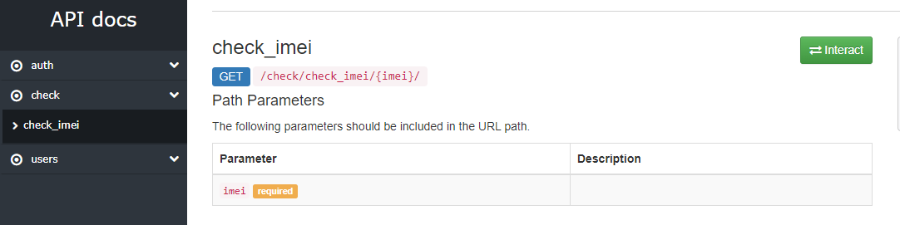
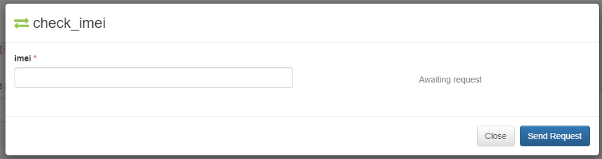
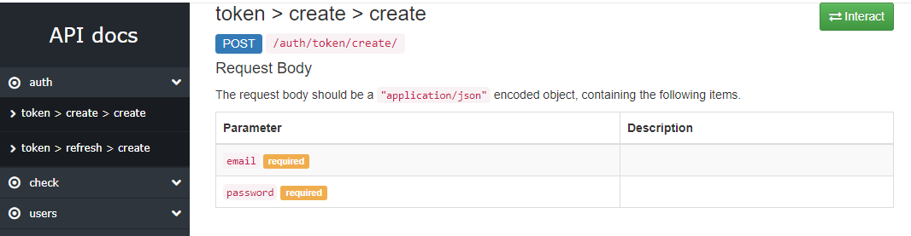
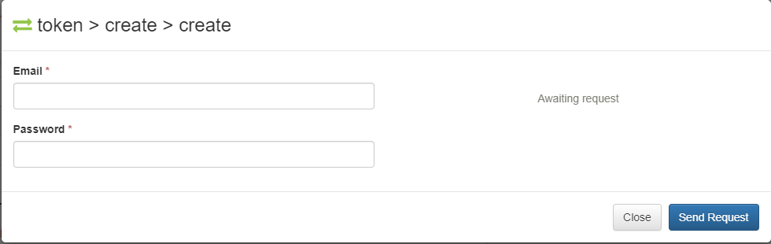
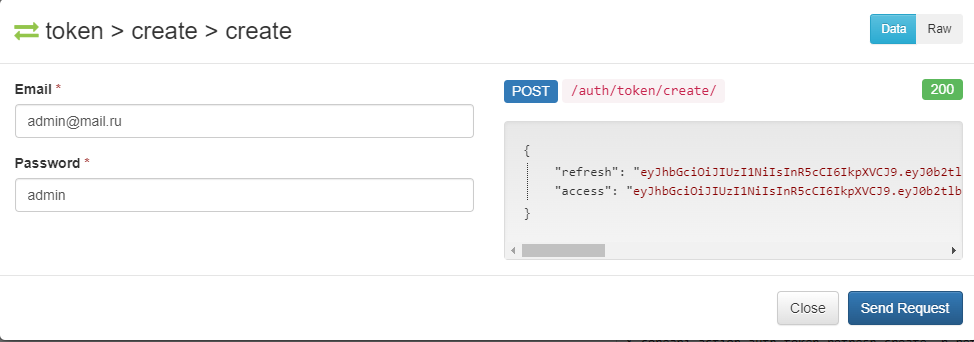
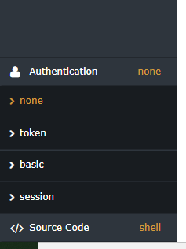
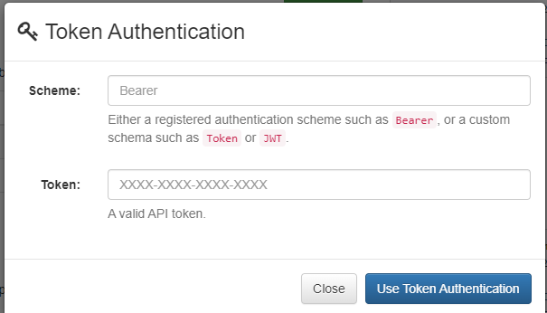

# Owner avatar CheckImeiWithDRFAndTelegram
Телеграм бот IMEI


<!--Установка-->
## Установка 
У вас должны быть установлены [зависимости проекта](https://github.com/Mike0001-droid/CheckImeiWithDRFAndTelegram/blob/main/requirements.txt)

1. Клонирование репозитория 

```git clone https://github.com/Mike0001-droid/CheckImeiWithDRFAndTelegram.git```

2. Создание виртуального окружения

```python -m venv venv```

3. Активация виртуального окружения

```cd venv/scripts/activate```

4. Установка зависимостей

```pip install -r requirements.txt```

5. Запуск миграций

```python manage.py migrate```

6. Создание админа

```python manage.py createsuperuser```

7. Запуск сервера

```python manage.py runserver```

## Запуск бота

1. Переходим в директорию bot

```cd bot```

2. Запускаем файл aiogram_run.py

```python aiogram_run.py```


## Возможности сервиса

1. Проверка IMEI через API DRF 
    * Запускаем сервер Django
    * Переходим по адресу /api
    * Открываем приложение check 
      
    * Вставляем IMEI в форму
      

2. Авторизация по JWT - токену
    * Запускаем сервер Django
    * Переходим по адресу /api
    * Открываем приложение auth 
      
    * Кликаем на метод создания токена и вводим свои данные
      
    * Копируем access токен из результата запроса
      
    * В нижнем левом углу нажимаем на вкладку Authentication и нажимаем на token
      
    * Записываем в поле Scheme - Bearer, а в поле Token вставляем скопированный токен
      

3. Проверка IMEI через Telegram бота
    * Запускаем бота по инструкции выше
    * Используем команду /start
    * Вводим свой IMEI и получаем результат
    